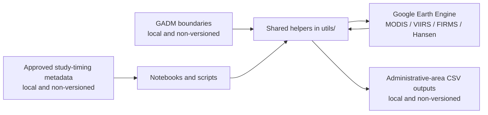

# VACS satellite-exposure workflows

Reproducible code for constructing country- and administrative-area satellite
exposure measures with Google Earth Engine. The tracked repository contains
source code, configuration, and methods documentation; raw and processed study
data remain outside version control.

## What the repository computes

- MODIS FIRMS active-fire detection counts
- MODIS MOD14A1/MYD14A1 fire radiative power (FRP)
- MODIS MCD64A1 burned area
- VIIRS VNP14A1 active-fire counts and FRP
- VIIRS VNP64A1 burned area
- MODIS MAIAC MCD19A2 aerosol optical depth (AOD)
- Hansen Global Forest Change zonal summaries for the Zambia pilot

Shared Earth Engine and tabular helpers live under `utils/`. Country and
demonstration notebooks live under `exposure_notebooks/`, while command-line
entry points live under `scripts/`.

## Exposure workflow



Exposure windows are defined from approved project-level study dates. Satellite
pixels are summarized to GADM administrative boundaries; no respondent-level
records are required by the tracked satellite pipeline.

## Repository map

| Path | Role |
|---|---|
| `config/` | Non-sensitive country/run configuration |
| `exposure_notebooks/` | GEE and FIRMS exploration and demonstrations |
| `utils/` | Shared boundary, date, QA, aggregation, and export helpers |
| `scripts/` | Reproducible command-line export and crosswalk entry points |
| `gee_zambia/` | Hansen zonal helper and Zambia GEE notes |
| `report_outputs/` | Versioned aggregate methods/progress documentation |

## Data and credential boundary

- `data/`, generated outputs, local working notes, and test fixtures are ignored.
- Respondent-level statistical files are explicitly ignored by extension as a
  defense-in-depth safeguard, even if placed outside `data/` accidentally.
- Credentials belong in the local environment or `.env`; `.env` files are
  ignored. Do not place Earth Engine credentials or FIRMS map keys in notebooks,
  scripts, outputs, or documentation.
- Crosswalk scripts accept non-sensitive CSVs containing only distinct approved
  geography labels. They do not require respondent-level source files.
- Before publishing changes, review `git diff --cached` and scan the tracked
  snapshot for credentials and prohibited data references.

## Setup

Use Python 3.11 or newer:

```bash
python -m venv .venv
source .venv/bin/activate
pip install -r requirements.txt
```

Authenticate Earth Engine and set the project locally:

```bash
export EARTHENGINE_PROJECT="your-earth-engine-project"
```

For optional FIRMS API examples, set `FIRMS_MAP_KEY` locally. Never commit its
value.

Individual scripts expose their arguments through `--help`. Boundary inputs and
generated CSVs are expected under ignored local directories unless an explicit
path is supplied.
